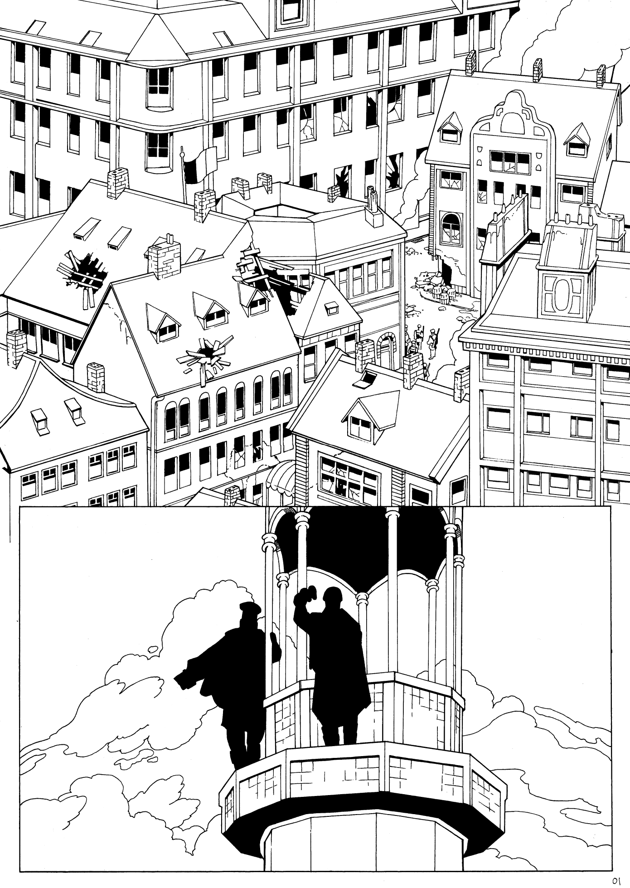
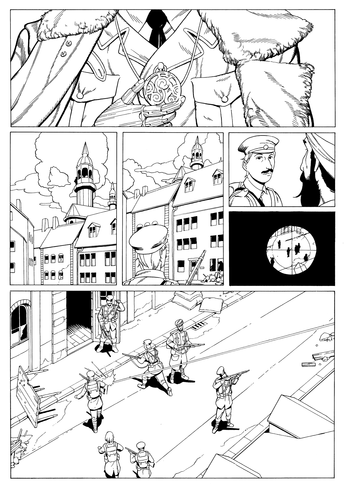
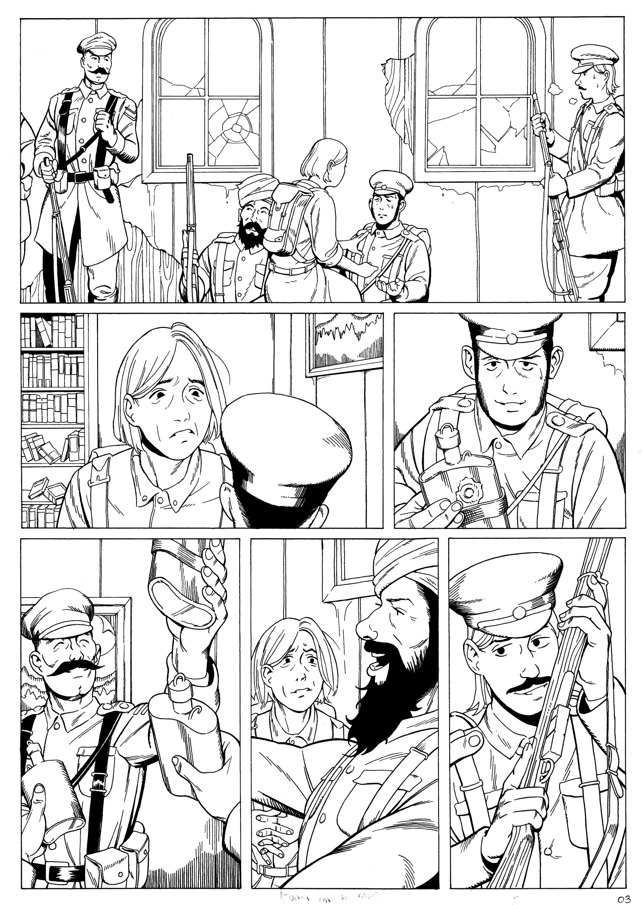
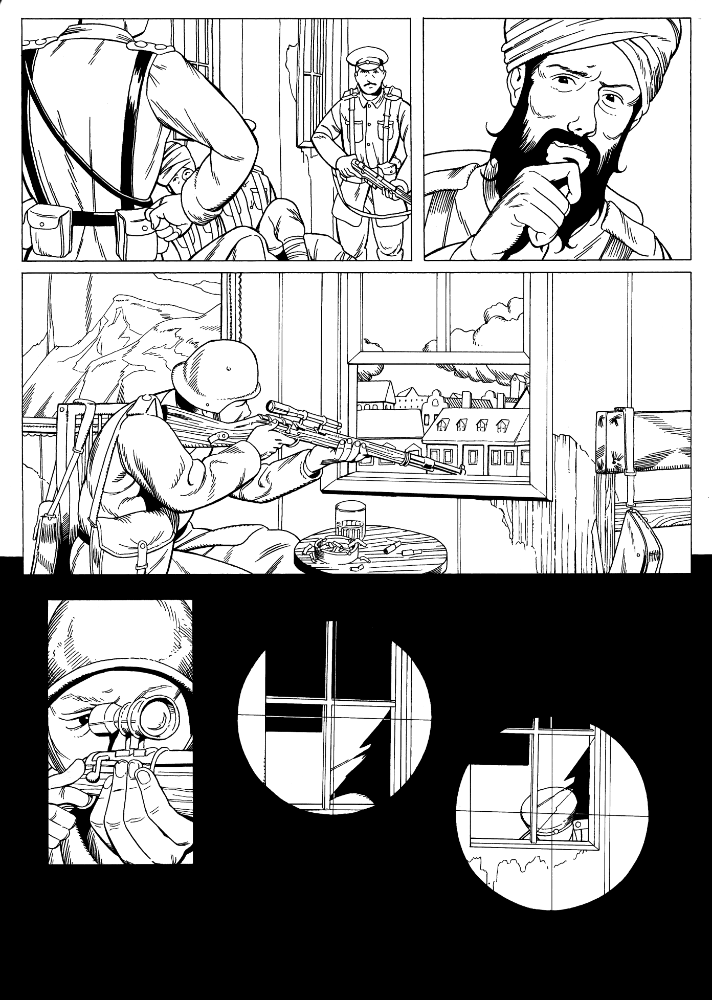

# Cancelled WW1 Horror

This started out as a pitch for a new graphic novel set during the great war. The premise was that in a war-torn Europe there'd be traces of a cult determined to bring horrors into our world. But as Russia invaded Ukraine in 2022 I no longer wanted to write and draw a comic about war in Europe.

Here's as far as I got drawing-wise. No dialogue added yet.

 

 
 
 
 